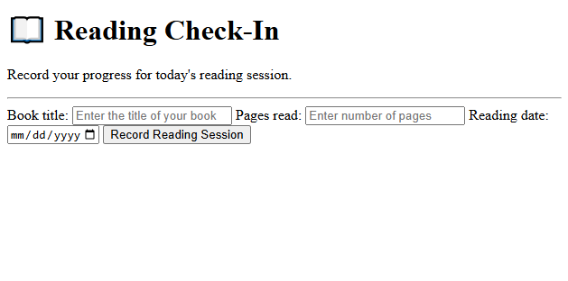

# Reading Check-In

A simple HTML form that allows readers to record their daily reading progress by entering a book title, the number of pages read, and the reading date.

## Features

* Collects a book title, page count, and reading date.
* Uses appropriate HTML input types.
* Includes associated labels for form accessibility.
* Applies native browser validation to required fields.
* Restricts page counts to positive whole numbers.
* Limits the reading date to a fixed maximum date.

## Concepts Practiced

* HTML document structure
* Forms and input elements
* Input types and attributes
* Labels and input associations
* Required fields and native validation
* Minimum, maximum, and step constraints
* Form field names

## Demo

## Limitations

This project uses HTML only. Reading sessions are not stored, and the maximum reading date is hardcoded rather than updated automatically.

## Future Improvements

* Style the form with CSS.
* Use JavaScript to set the maximum date dynamically.
* Add functionality to save and display reading sessions.

## Author

Built as part of my HTML learning journey through practical, problem-solving projects.
