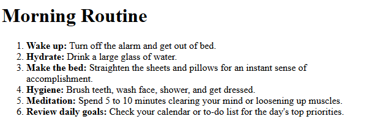

# 02 — Morning Routine

## Overview

A simple HTML page that represents a sequence of morning activities using an ordered list.

## Problem

Create a webpage that communicates a morning routine where the sequence of activities carries meaning.

## Requirements

* Create a valid HTML document.
* Add a page title: **Morning Routine**.
* Add a main heading: **Morning Routine**.
* Display at least six morning activities.
* Represent the activities using an ordered list.
* Represent each activity as an individual list item.
* Use HTML only.
* Do not manually add list numbers.

## Concepts

* `<ol>` — ordered list
* `<li>` — list item
* Ordered vs unordered lists
* Semantic HTML
* Meaningful sequence
* Appropriate use of `<br>`

## Solution

The page uses `<ol>` to communicate that the sequence of the morning activities is meaningful. Each activity is represented with `<li>`.

```html
<ol>
  <li><strong>Wake up:</strong> Turn off the alarm and get out of bed.</li>
  <li><strong>Hydrate:</strong> Drink a large glass of water.</li>
  <li><strong>Make the bed:</strong> Straighten the sheets and pillows.</li>
  <li><strong>Hygiene:</strong> Brush teeth, wash face, shower, and get dressed.</li>
  <li><strong>Meditation:</strong> Spend 5 to 10 minutes clearing your mind.</li>
  <li><strong>Review daily goals:</strong> Check the day's top priorities.</li>
</ol>
```

## Key Learning

`<ol>` defines an ordered list, while `<li>` represents each individual list item.

The choice between `<ul>` and `<ol>` should be based on the **meaning of the information**. `<ol>` is appropriate when the sequence of items matters.

`<br>` is intended for creating a line break within text, not for controlling spacing between separate list items.

## Testing

Verified that:

* All six activities render correctly.
* Activities are displayed in an ordered sequence.
* The browser generates the numbers automatically.
* No numbers were manually added.
* Each activity is represented by an `<li>`.
* Unnecessary `<br>` elements were removed.
* The HTML structure is properly nested.

## Demo

**Screenshot:** 



## Status

✅ Completed
