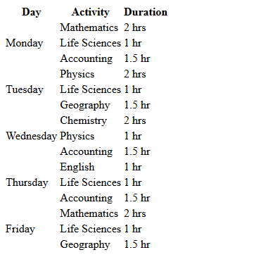

# Weekly Study Schedule

A semantic HTML table representing a five-day study schedule, including multiple activities and durations for each day.

## Problem

Create a structured way to represent a weekly study schedule using HTML.

The schedule needed to show:

* The day
* The study activity
* The duration
* Multiple activities for each day

## Requirements

* Represent the schedule using an HTML `<table>`.
* Use rows and cells to organize the information.
* Distinguish table headings from table data.
* Represent one day across multiple activity rows.

## HTML Concepts

This project introduced:

* `<table>` — defines the table.
* `<tr>` — defines a table row.
* `<th>` — defines a heading cell.
* `<td>` — defines a data cell.
* `rowspan` — allows one cell to span multiple rows.

## Key Structure

Each day contains three activities. The day cell spans those three rows using `rowspan="3"`.

```html
<tr>
  <td rowspan="3">Monday</td>
  <td>Mathematics</td>
  <td>2 hrs</td>
</tr>
```

This represents the relationship between one day and its multiple activities directly in the table structure.

## What I Learned

A table is structured from the outside in:

```text
<table>
    ↓
<tr>
    ↓
<th> / <td>
```

I also learned that when one piece of information applies to multiple rows, the relationship can be represented explicitly with `rowspan` rather than leaving cells empty.

## Demo



## Status

Complete
