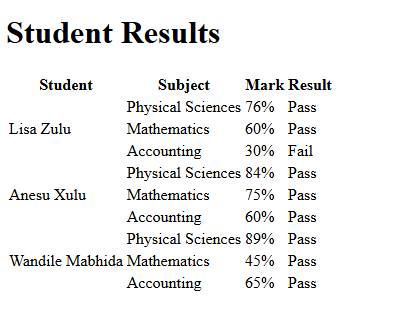

# Student Results

A semantic HTML table representing the academic results of multiple students across different subjects.

## Problem

Create a structured way to represent student results so that each student's subjects, marks, and results can be clearly associated.

The table needed to show:

* Student
* Subject
* Mark
* Result

## Requirements

* Represent the results using an HTML `<table>`.
* Use clear headings for each category of information.
* Display results for multiple students.
* Display multiple subjects for each student.
* Distinguish headings from actual data.
* Represent each student's multiple subjects within the table structure.

## HTML Concepts

This project reinforced:

* `<table>` — defines the table.
* `<tr>` — defines a table row.
* `<th>` — defines a table heading cell.
* `<td>` — defines a table data cell.
* `rowspan` — allows one student name to span multiple subject rows.

## Key Structure

Table headings use `<th>` because they identify what the columns represent.

```html
<tr>
  <th>Student</th>
  <th>Subject</th>
  <th>Mark</th>
  <th>Result</th>
</tr>
```

Student results use `<td>` because they represent actual data.

```html
<tr>
  <td rowspan="3">Lisa Zulu</td>
  <td>Physical Sciences</td>
  <td>76%</td>
  <td>Pass</td>
</tr>
```

## What I Learned

I learned that `<th>` and `<td>` have different semantic roles:

* `<th>` identifies a heading.
* `<td>` represents table data.

I also reinforced how `rowspan` can represent a relationship where one student applies to multiple rows of related results.

## Demo



## Status

Complete
