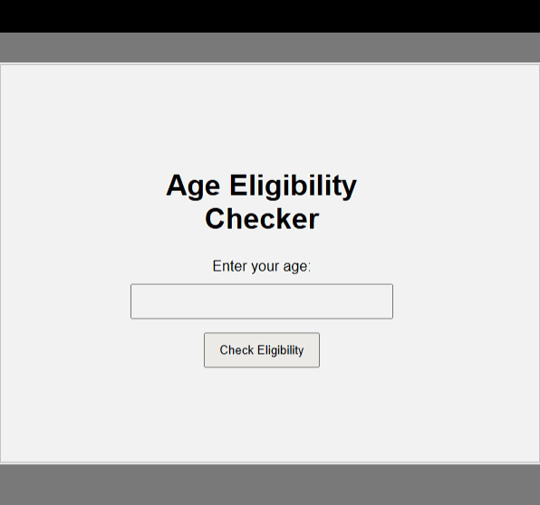

# Age Eligibility Checker

A small browser-based program built with HTML, CSS, and JavaScript to practice solving real-world problems using conditional statements.

## Problem

Determine whether a person is eligible to enter based on their age.

The rule is:

> A person must be 18 or older to be allowed entry.

The program also needs to handle the situation where no age is entered.

## Decision Logic

The program makes decisions in this order:

1. Check whether the user entered an age.
2. If no age was entered, ask the user to enter their age.
3. If an age was entered, check whether it is 18 or older.
4. If the age is 18 or older, allow access.
5. Otherwise, deny access.

In simplified form:

```text
            Did the user enter an age?
                  /          \
                NO            YES
                ↓              ↓
           Enter age       Is age >= 18?
                            /        \
                          YES        NO
                           ↓          ↓
                    Access Allowed  Access Denied
```

## Technologies

* HTML
* CSS
* JavaScript

## JavaScript Concepts Practiced

* `document.getElementById()`
* Reading an input's `.value`
* `addEventListener()`
* `if`
* `else if`
* `else`
* Comparison operators
* Boolean results
* `Number()` for converting input values
* Conditional decision ordering

## What I Learned

One of the biggest lessons from this problem was that **the order of conditions matters**.

Initially, I considered checking whether the age was below 18 before checking whether the input was empty. That produced an unexpected result because JavaScript's type coercion can cause an empty string to behave like `0` in a numeric comparison.

This taught me to think about a problem in layers:

```text
Input validation
      ↓
Business rule
      ↓
Action
```

I also learned that an `if / else if / else` chain is evaluated from top to bottom, and the first true condition determines the path the program takes.

## Test Cases

| Input | Expected Result | Actual Result  |
| ----- | --------------- | -------------- |
| `25`  | Access Allowed  | Access Allowed |
| `18`  | Access Allowed  | Access Allowed |
| `17`  | Access Denied   | Access Denied  |
| `0`   | Access Denied   | Access Denied  |
| Empty | Enter age       | Enter age      |

## Project Demo



## Project Structure

```text
01-age-eligibility-checker/
├── index.html
├── style.css
├── script.js
└── README.md
```

## Purpose

This project is part of a growing collection of small real-world programs created to strengthen my problem-solving skills with JavaScript conditionals.
