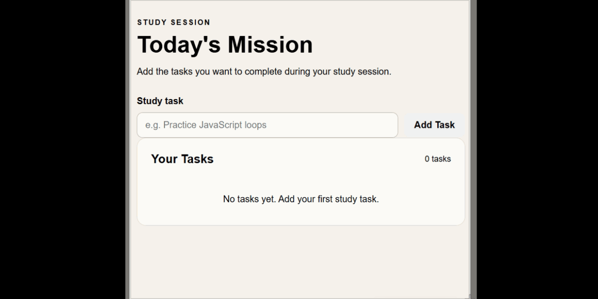

# Study Session Tracker

A small browser-based program built with HTML, CSS, and JavaScript to practice working with forms, arrays, loops, functions, events, and DOM manipulation.

## Problem

Create a program that allows a user to enter tasks and build a list of tasks on the page.

The program needs to:

* Allow the user to enter a task.
* Capture the submitted task.
* Store tasks in an array.
* Render the tasks on the page.
* Handle empty task input so that blank tasks are not displayed.

## Program Logic

The program processes tasks in the following order:

1. The user enters a task.
2. The form submission event is triggered.
3. The default form submission behavior is prevented.
4. The input value is read.
5. The program checks whether the task contains usable content.
6. If the task is not empty, it is added to the `tasks` array.
7. The `tasks` array is processed by a loop.
8. Each task is rendered on the page.

In simplified form:

```text
          User enters a task
                  ↓
          Submit the form
                  ↓
        Prevent default submit
                  ↓
          Read input value
                  ↓
            Is it empty?
             /       \
           YES        NO
            ↓         ↓
         Ignore    Add to array
                        ↓
                  Loop through
                  tasks array
                        ↓
                   Render tasks
```

## Technologies

* HTML
* CSS
* JavaScript

## JavaScript Concepts Practiced

* `document.getElementById()`
* `.value`
* `addEventListener()`
* `preventDefault()`
* Arrays
* `.push()`
* Functions
* `for` loops
* Conditional statements
* DOM manipulation
* Template literals

## What I Learned

One of the biggest lessons from this problem was understanding that the **array and the page have different jobs**.

The `tasks` array is the program's collection of data:

```javascript
let tasks = [];
```

When a user submits a task, the task is added to that collection:

```javascript
tasks.push(task);
```

The loop's job is different. It processes the entire collection and renders the tasks:

```text
tasks array
    ↓
loop
    ↓
render each task
```

This helped me understand an important pattern in JavaScript:

**store the data → process the collection → render the result.**

I also learned why empty input needs to be handled before rendering. An empty string can still be added to an array, which means the rendering loop would process it and could produce an empty line on the page.

This taught me to think about the data before allowing it into the collection:

```text
User input
    ↓
Validate input
    ↓
Store valid data
    ↓
Process collection
    ↓
Render result
```

## Test Cases

| Input              | Expected Result         | Actual Result           |
| ------------------ | ----------------------- | ----------------------- |
| `Study JavaScript` | Task is added           | Task is added           |
| `Build a project`  | Task is added           | Task is added           |
| `Go for a walk`    | Task is added           | Task is added           |
| Empty input        | Nothing is added        | Nothing is added        |
| Multiple tasks     | All tasks are displayed | All tasks are displayed |

## Project Demo



## Project Structure

```text
task-list/
├── index.html
├── style.css
├── script.js
└── README.md
```

## Purpose

This project is part of a growing collection of small real-world programs created to strengthen my problem-solving skills with JavaScript.


